<h1 align="center"> bspwm-Predator </h1>

 BSPWM Configurations for exodia Predator edition 

<!-- shields -->

  
   
  
  
   
  
  
  
   
  
  
  

<!-- shields -->

<!-- reviewing themes -->

<!-- reviewing themes -->

<!-- ###########################################  ########################################### -->

<!-- Available Themes Previews -->

<h2 align="center">Available Themes Previews</h2>

|Red Jungles|Emilia|Chad WM|
|--|--|--|
| 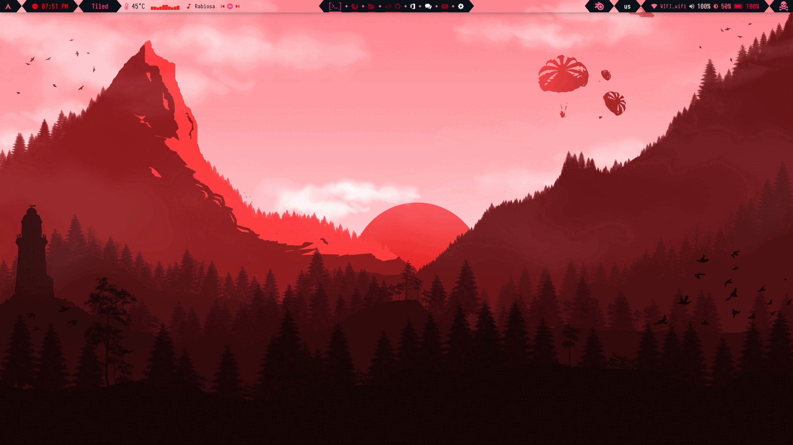 |  | 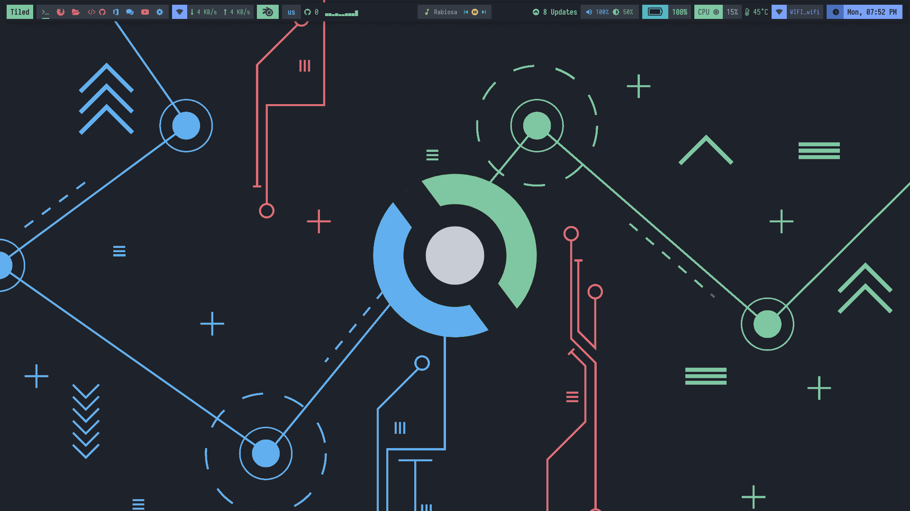 |

|Hack|Red and Black|Rick|
|--|--|--|
| 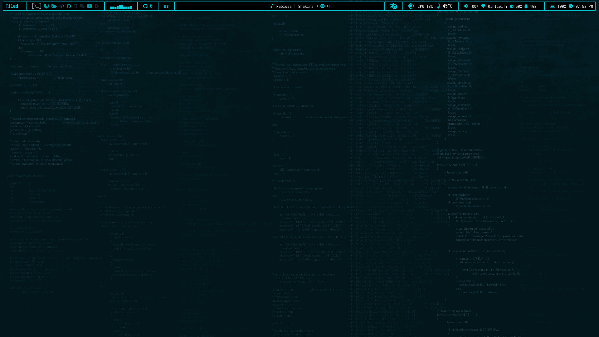 | 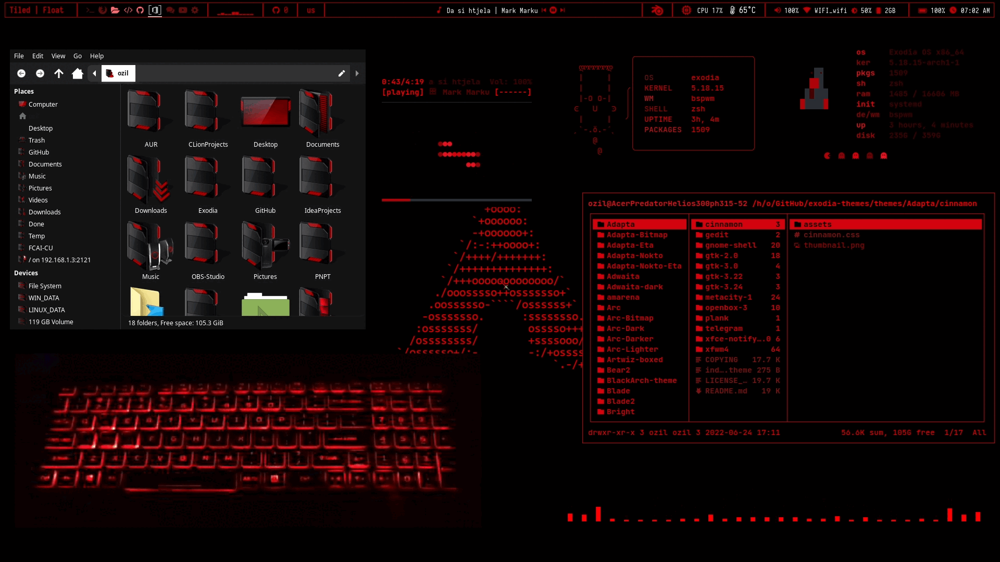 | 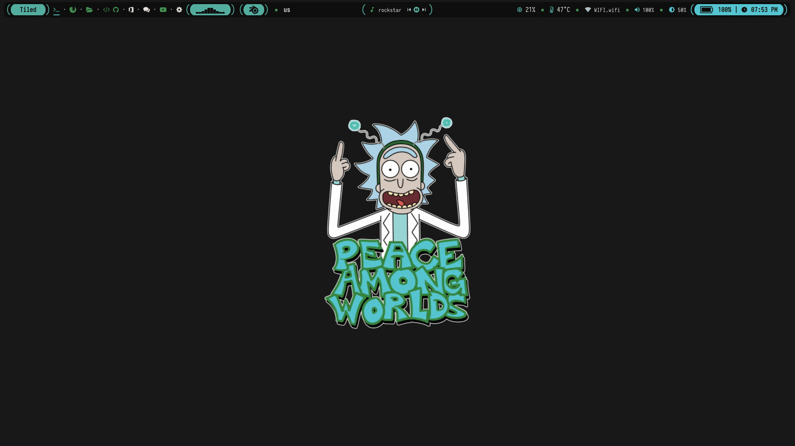 |

|Hack The Box|BlackArch|Neon|
|--|--|--|
| 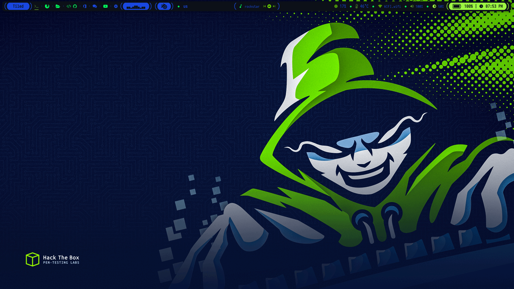 |  | 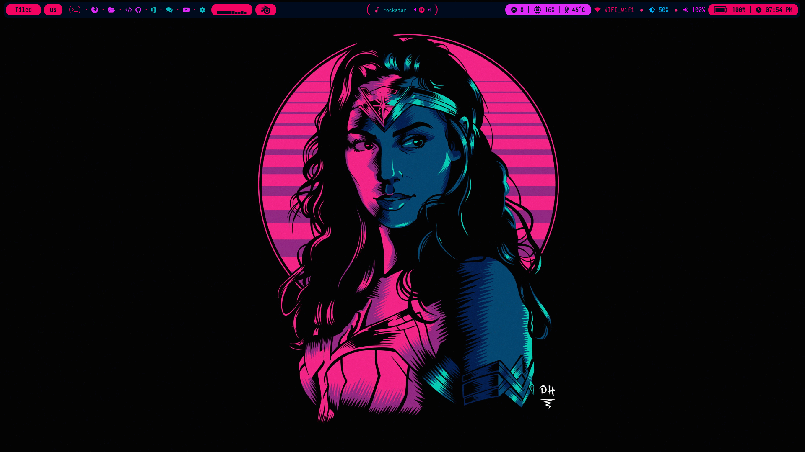 |

|Japanese City|VALORANT|Tokyo City |
|--|--|--|
| 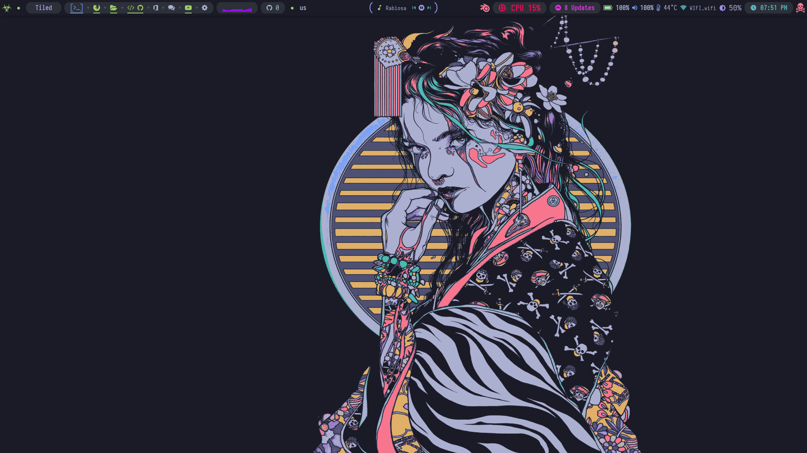 | 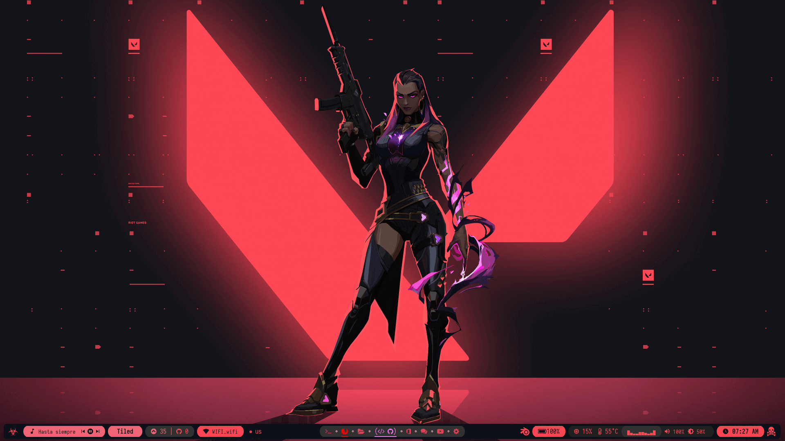 | 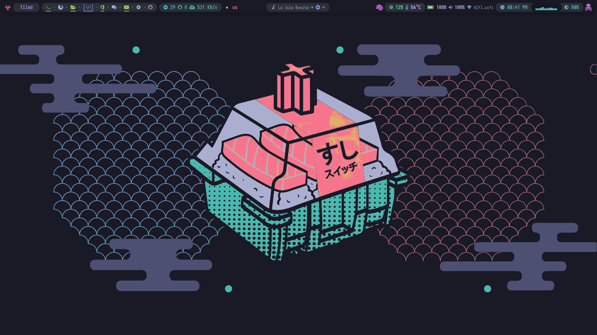 |

|JS coffee|Amarena|
|--|--|
| 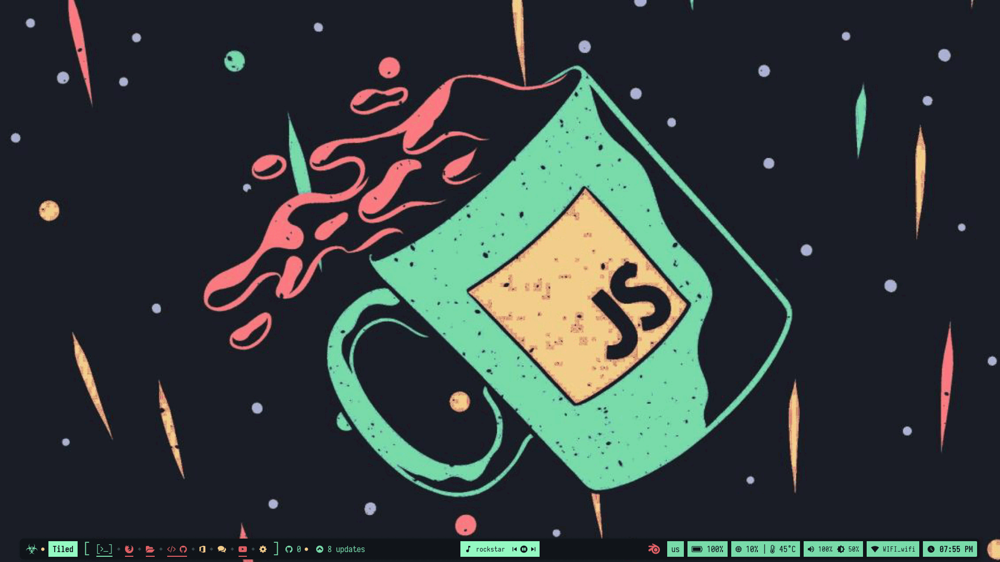 | 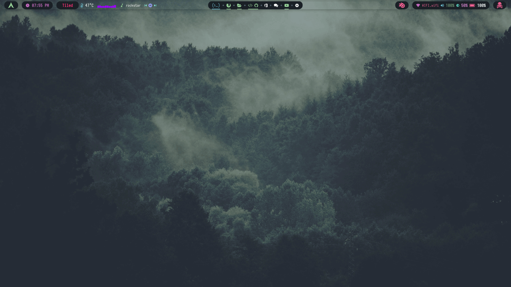 |

<!-- Available Themes Previews -->

<!-- ########################################### END ########################################### -->
